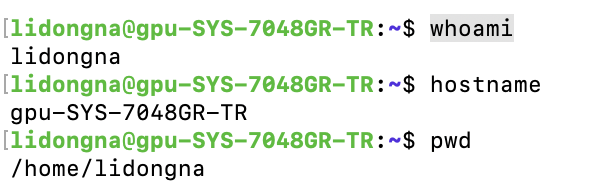
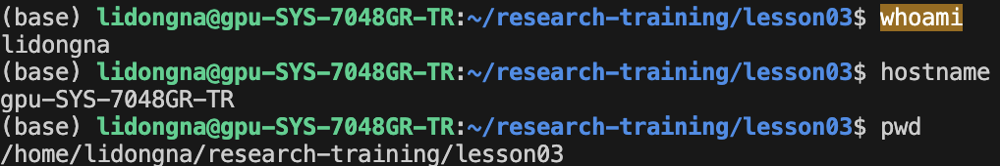
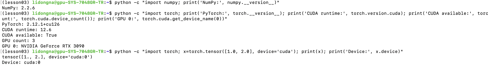
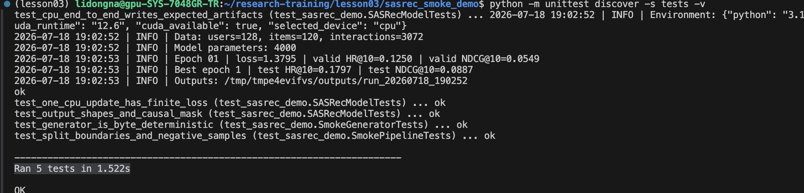
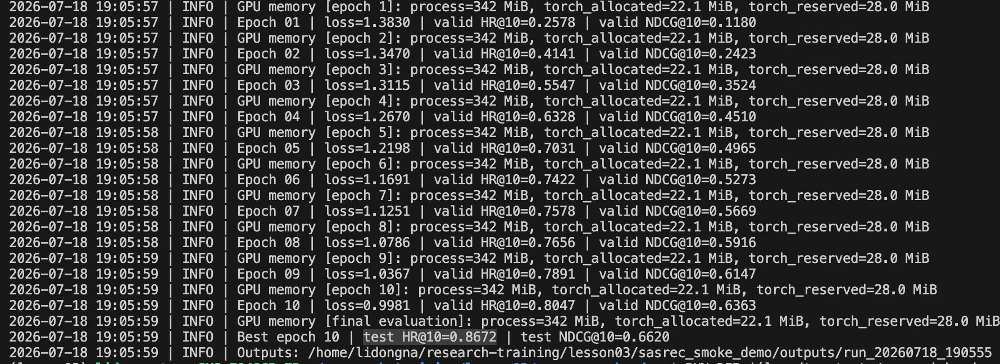
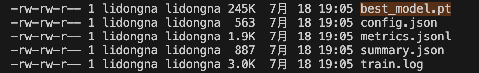
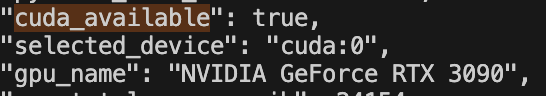

## 今日作业内容

今天完成第三次课“深度学习环境配置、服务器连接与实验室资源使用”的作业。本次通过 Tailscale 和 SSH 成功连接实验室 GPU 服务器，并完成 VS Code Remote SSH、服务器端 Miniconda 安装、Conda 环境配置、PyTorch 与 CUDA 验证、Linux 常用命令练习以及 SASRec Smoke 实验。

本次以实验室服务器 GPU 路线为主，不再使用此前配置的 Mac 本地 CPU 环境。所有课程环境和实验文件均保存在服务器个人 Home 目录中，不影响 Mac 本地的 Anaconda 环境和其他项目。

## 作业完成情况

### 一、服务器连接与个人目录配置

- [x] 通过 Tailscale 接入实验室虚拟网络
- [x] 使用 SSH 登录实验室 GPU 服务器
- [x] 确认远程用户名、主机名和个人 Home 目录
- [x] 创建第三次课个人课程目录
- [x] 配置 VS Code Remote SSH
- [x] 在 VS Code 中打开远程课程目录
- [x] 使用 VS Code 远程终端执行服务器命令

服务器信息如下：

- 服务器用户名：`lidongna`
- 服务器主机名：`gpu-SYS-7048GR-TR`
- 服务器系统：Ubuntu 22.04.2 LTS
- 服务器架构：`x86_64`
- 个人 Home 目录：`/home/lidongna`
- 课程目录：`/home/lidongna/research-training/lesson03`
- 远程连接方式：Tailscale + SSH
- VS Code 远程主机名称：`lab-server`

服务器身份检查结果为：

```text
whoami
lidongna

hostname
gpu-SYS-7048GR-TR

pwd
/home/lidongna
```

在个人 Home 目录中创建课程目录：

```text
/home/lidongna/research-training/lesson03
```



*图1 服务器 SSH 登录及远程身份验证*



*图2 VS Code Remote SSH 连接结果*

### 二、服务器端 Miniconda 与 Conda 环境配置

- [x] 检查服务器架构为 `x86_64`
- [x] 下载 Linux x86_64 版本的 Miniconda 安装包
- [x] 将 Miniconda 安装到个人目录 `~/miniconda3`
- [x] 完成 Conda Shell 初始化
- [x] 配置 Conda 清华 TUNA 镜像
- [x] 配置 pip 清华 TUNA 镜像
- [x] 创建独立 Conda 环境 `lesson03`
- [x] 在 `lesson03` 环境中安装 Python 3.10
- [x] 检查 Python 和 pip 的实际路径

Miniconda 安装位置为：

```text
/home/lidongna/miniconda3
```

课程环境信息如下：

- Conda 版本：`26.5.3`
- Conda 环境：`lesson03`
- Python 路径：`/home/lidongna/miniconda3/envs/lesson03/bin/python`
- Python 版本：`3.10.20`
- pip 配置文件：`/home/lidongna/.config/pip/pip.conf`
- pip 镜像地址：`https://pypi.tuna.tsinghua.edu.cn/simple`

环境激活后的检查结果为：

```text
(lesson03)

which python
/home/lidongna/miniconda3/envs/lesson03/bin/python

python --version
Python 3.10.20
```

### 三、PyTorch、CUDA 与 GPU 配置

- [x] 使用 `nvidia-smi` 检查服务器 GPU 状态
- [x] 确认服务器驱动支持 CUDA 12.6
- [x] 在 `lesson03` 环境中安装 GPU 版本 PyTorch
- [x] 安装 NumPy
- [x] 验证 PyTorch 可以正常导入
- [x] 验证 CUDA 可以正常使用
- [x] 验证 PyTorch 可以识别 RTX 3090
- [x] 成功在 GPU 上创建张量
- [x] 确认服务器共有 3 张 GPU

服务器 GPU 信息如下：

- GPU 数量：`3`
- GPU 型号：`NVIDIA GeForce RTX 3090`
- 单张 GPU 显存：约 24 GB
- NVIDIA 驱动版本：`560.35.03`
- 驱动支持的 CUDA 版本：`12.6`

课程环境验证结果如下：

- NumPy 版本：`2.2.6`
- PyTorch 版本：`2.12.1+cu126`
- PyTorch CUDA Runtime：`12.6`
- CUDA 可用性：`True`
- PyTorch 可识别 GPU 数量：`3`
- GPU 张量设备：`cuda:0`

GPU 张量测试结果为：

```text
tensor([1., 2.], device='cuda:0')
Device: cuda:0
```

该结果说明 PyTorch 不仅能够识别服务器 GPU，而且已经成功在 GPU 上完成张量创建与存储。



*图3 lesson03 环境及 PyTorch CUDA 验证结果*

### 四、VS Code Remote SSH 配置

在 Mac 本地的 SSH 配置文件中添加远程主机信息：

```text
Host lab-server
    HostName 100.91.36.18
    User lidongna
    Port 22
```

配置完成后，通过 VS Code 的 Remote SSH 扩展连接 `lab-server`，选择远程平台类型为 Linux，并在服务器端完成 VS Code Server 初始化。

连接成功后，VS Code 左下角显示：

```text
SSH: lab-server
```

在 VS Code 远程终端中检查结果如下：

```text
whoami
lidongna

hostname
gpu-SYS-7048GR-TR

pwd
/home/lidongna/research-training/lesson03
```

这说明 VS Code 已经能够直接浏览服务器文件，并在远程服务器中运行终端命令和实验代码。

### 五、Linux 常用命令练习

在服务器课程目录下创建 Linux 练习目录：

```text
/home/lidongna/research-training/lesson03/linux_practice
```

完成的 Linux 命令练习包括：

- [x] 使用 `mkdir` 创建目录
- [x] 使用 `cd` 切换目录
- [x] 使用 `pwd` 检查当前路径
- [x] 使用 `ls -lah` 查看目录内容和文件属性
- [x] 使用 `touch` 和 `printf` 创建文本文件
- [x] 使用 `cat` 查看完整文件内容
- [x] 使用 `head` 查看文件前几行
- [x] 使用 `tail` 查看文件后几行
- [x] 使用 `cp` 复制文件
- [x] 使用 `mv` 移动和重命名文件
- [x] 使用 `grep` 搜索指定内容
- [x] 使用 `find` 查找文件
- [x] 使用 `du` 查看目录占用空间
- [x] 使用 `df` 查看磁盘容量
- [x] 使用 `ps` 查看个人账号进程
- [x] 使用 `which` 查看命令和程序路径
- [x] 创建并运行 Shell 脚本
- [x] 使用 `chmod` 添加执行权限
- [x] 使用 `rm -i` 安全删除练习副本
- [x] 使用 `history` 查看命令历史

在练习目录中创建了 `notes.txt`，文件内容为：

```text
Linux command practice
GPU environment check
SASRec smoke demo
```

创建的 Shell 脚本 `hello.sh` 内容为：

```bash
#!/usr/bin/env bash
echo "Hello from Linux"
```

添加执行权限并运行后，成功输出：

```text
Hello from Linux
```

练习结束后保留的文件包括：

```text
notes.txt
hello.sh
```

磁盘检查结果显示，服务器磁盘总容量约为 1.8 TB，当前剩余空间约为 474 GB。

### 六、SASRec Smoke 实验

将完整的 `sasrec_smoke_demo` 课程包上传到服务器目录：

```text
/home/lidongna/research-training/lesson03/sasrec_smoke_demo
```

课程包主要包含：

```text
data/smoke_interactions.csv
generate_smoke_data.py
README.md
sasrec_demo.py
tests/test_sasrec_demo.py
```

#### 1. 固定数据检查

使用以下命令检查数据文件：

```bash
head -n 6 data/smoke_interactions.csv
wc -l data/smoke_interactions.csv
```

数据表头为：

```text
user_id,item_id,timestamp
```

数据文件总行数为：

```text
3073
```

其中包括 1 行表头和 3072 条用户—物品交互记录。

#### 2. 数据确定性重建

运行数据重新生成脚本：

```bash
python generate_smoke_data.py \
  --output /tmp/smoke_interactions_regenerated.csv
```

脚本成功生成 3072 条交互记录。随后使用 `cmp` 对比原始数据和重新生成的数据：

```bash
cmp data/smoke_interactions.csv \
  /tmp/smoke_interactions_regenerated.csv
```

命令执行后没有输出，说明两个文件逐字节完全一致，Smoke 数据生成过程具有确定性。

#### 3. 自动测试

运行自动测试命令：

```bash
python -m unittest discover -s tests -v
```

共完成 5 项测试：

- CPU 端到端训练与结果文件生成测试
- 单步参数更新与有限损失测试
- 模型输出形状与因果掩码测试
- Smoke 数据确定性生成测试
- 数据集划分与负样本构造测试

测试结果为：

```text
Ran 5 tests in 1.522s

OK
```

说明数据处理、模型结构、因果掩码、损失计算和 CPU 训练流程均正常。



*图4 SASRec 自动测试结果*

#### 4. GPU 环境检查

运行 GPU 检查命令：

```bash
CUDA_VISIBLE_DEVICES=0 \
python sasrec_demo.py \
  --device cuda \
  --check-only
```

检查结果如下：

- Python：`3.10.20`
- PyTorch：`2.12.1+cu126`
- CUDA Runtime：`12.6`
- CUDA 可用：`True`
- 选定设备：`cuda:0`
- GPU：`NVIDIA GeForce RTX 3090`
- 可见 GPU 数量：`1`

`CUDA_VISIBLE_DEVICES=0` 表示程序只使用物理 GPU 0。该物理 GPU 在程序内部会重新编号为逻辑设备 `cuda:0`。

#### 5. SASRec GPU 训练

按照课程给定参数完成 10 轮 SASRec Smoke 训练：

```bash
CUDA_VISIBLE_DEVICES=0 python sasrec_demo.py \
  --device cuda \
  --epochs 10 \
  --batch-size 32 \
  --max-len 20 \
  --hidden-size 64 \
  --num-heads 2 \
  --num-blocks 2 \
  --allocator-limit-mib 700 \
  --gpu-budget-mib 1024
```

实验参数如下：

- 训练轮数：`10`
- Batch Size：`32`
- 最大序列长度：`20`
- 隐藏层维度：`64`
- 注意力头数：`2`
- Transformer Block 数量：`2`
- 显存分配限制：`700 MiB`
- GPU 显存预算：`1024 MiB`

训练数据规模如下：

- 用户数：`128`
- 物品数：`120`
- 交互记录数：`3072`
- 模型参数量：`59648`

训练过程中，损失从第 1 轮的 `1.3830` 下降到第 10 轮的 `0.9981`，验证集 HR@10 和 NDCG@10 整体持续提升，说明模型能够正常学习用户交互序列中的规律。

最终实验结果如下：

- 最佳轮次：`10`
- 验证集 HR@10：`0.8047`
- 验证集 NDCG@10：`0.6363`
- 测试集 HR@10：`0.8672`
- 测试集 NDCG@10：`0.6620`
- GPU 峰值进程显存：`342 MiB`
- PyTorch 峰值已分配显存：约 `22.1 MiB`
- PyTorch 峰值保留显存：`28 MiB`
- GPU 显存预算：`1024 MiB`
- 是否在显存预算内：`True`

GPU 实际显存占用低于课程设置的 1024 MiB 上限，说明本次实验符合显存预算要求。



*图5 SASRec 训练及测试结果*

#### 6. 实验输出文件检查

本次运行结果保存在：

```text
outputs/run_20260718_190555
```

输出目录中包含：

```text
best_model.pt
config.json
metrics.jsonl
summary.json
train.log
```

各文件作用如下：

- `best_model.pt`：验证集表现最佳的模型参数
- `config.json`：本次实验使用的参数配置
- `metrics.jsonl`：各训练轮次的损失和评价指标
- `summary.json`：实验环境、数据规模、最终指标和显存使用情况汇总
- `train.log`：完整训练日志



*图6-1 SASRec 实验输出文件及主要指标*

 

*图6-2 SASRec 实验环境与 GPU 信息*
## 遇到的问题与排查过程

### 1. Conda 创建环境时出现服务条款错误

创建 `lesson03` 环境时，Conda 提示 Anaconda 默认频道的服务条款尚未接受，并显示以下频道：

```text
https://repo.anaconda.com/pkgs/main
https://repo.anaconda.com/pkgs/r
```

排查发现，新安装的 Miniconda 在安装目录的 `.condarc` 中保留了 `defaults` 频道，而个人 Home 目录中的配置使用的是 `conda-forge` 和 `nodefaults`。Conda 合并多个配置来源后仍然尝试访问默认频道，因此触发服务条款提示。

处理时先备份原配置，再移除安装目录中的 `defaults` 频道设置，保留课程要求的 `conda-forge` 与清华 TUNA 镜像。重新执行环境创建命令后，Python 3.10 环境成功建立。

### 2. PyTorch 首次导入时提示缺少 NumPy

PyTorch 安装完成后，首次导入时出现：

```text
Failed to initialize NumPy: No module named 'numpy'
```

检查后确认 PyTorch 2.12.1 和 CUDA 12.6 运行时均已正确安装，只是当前 `lesson03` 环境中没有 NumPy。

使用 pip 安装 NumPy 后，警告消失，PyTorch 版本检查、CUDA 可用性检查、GPU 数量检查和 GPU 张量测试均正常通过。

### 3. VS Code Remote SSH 首次连接失败

Mac 终端能够通过以下命令正常连接服务器：

```bash
ssh lab-server
```

但 VS Code Remote SSH 首次连接时提示无法与远程主机建立连接。排查后，在 VS Code 设置中启用了 Remote SSH 登录终端显示，使密码输入过程能够正常显示，并选择远程系统类型为 Linux。

完成设置后，VS Code Server 成功安装到远程服务器，VS Code 左下角显示：

```text
SSH: lab-server
```

此后可以直接在 VS Code 中浏览远程目录并运行服务器终端命令。

## 今日收获

通过本次作业，我进一步理解了本地环境、远程服务器环境和 Conda 独立环境之间的关系。Mac 本地的 Anaconda 与服务器个人目录中的 Miniconda 相互独立，在服务器中安装、升级或删除 Python 包不会影响本地环境和已有项目。

本次主要掌握了以下内容：

1. 使用 Tailscale 和 SSH 连接实验室 GPU 服务器。
2. 使用 VS Code Remote SSH 进行远程开发和代码管理。
3. 在没有管理员权限的情况下，将 Miniconda 安装到个人 Home 目录。
4. 使用 Conda 创建独立的 Python 环境，并配置 Conda 与 pip 镜像。
5. 使用 `nvidia-smi` 查看 GPU 型号、显存占用和运行进程。
6. 理解 NVIDIA 驱动、CUDA Runtime 和 PyTorch 版本之间的关系。
7. 理解 `CUDA_VISIBLE_DEVICES` 对物理 GPU 和逻辑 GPU 编号的映射作用。
8. 掌握 Linux 文件、目录、权限、进程、磁盘和脚本相关命令。
9. 掌握 Smoke 数据检查、确定性重建和自动测试流程。
10. 掌握 SASRec 模型的 GPU 训练、指标检查和输出文件管理流程。
11. 理解训练损失、HR@10、NDCG@10 和 GPU 显存占用等实验指标。
12. 明确共享服务器中应先检查 GPU 状态，不结束或占用其他用户的进程。

