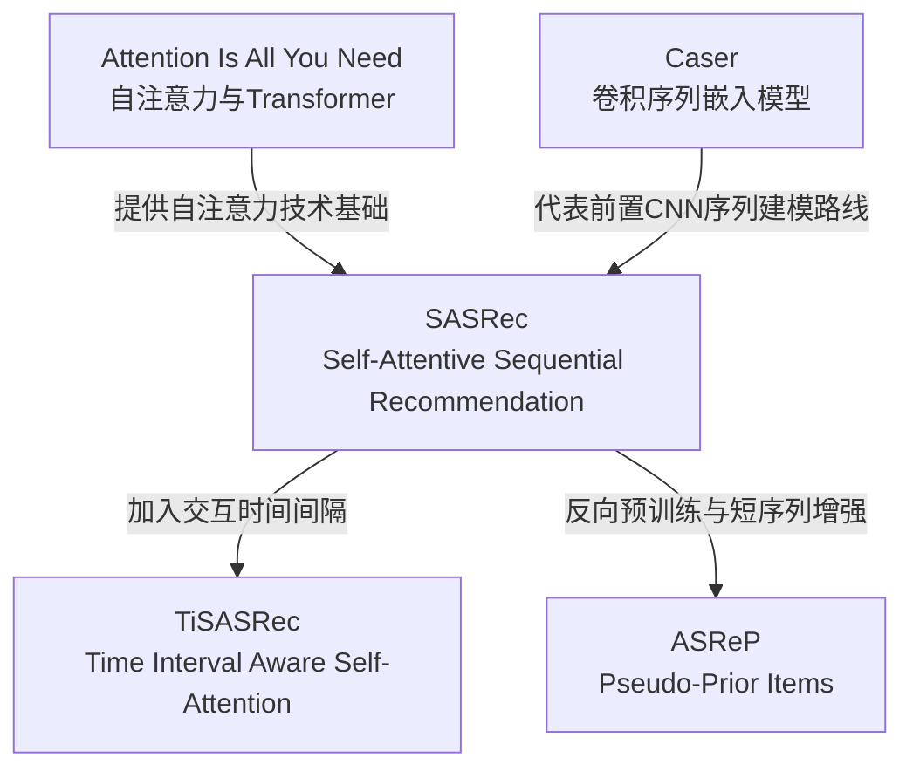

### 第一轮检索：领域宽泛检索

- 检索平台：Google Scholar
- 检索式：sequential recommendation
- 检索时间：2026年7月21日
- 检索结果：约2,880,000条
![[截屏2026-07-21 13.41.20.png]]

**图1 第一轮“sequential recommendation”检索结果**

本轮检索以“sequential recommendation”为关键词，目的是了解序列推荐领域的总体文献分布。结果中既包括 SASRec 等经典序列推荐模型，也包括综述论文、对比学习方法和去偏方法，说明该关键词能够覆盖主要研究内容，但检索范围过宽，难以直接确定与当前研究任务最相关的论文。

在前几项结果中，*Self-Attentive Sequential Recommendation* 属于基于自注意力机制的经典论文，*A Survey of Sequential Recommendation Systems* 属于综述论文，*Contrastive Learning for Sequential Recommendation* 和 *Debiased Contrastive Learning for Sequential Recommendation* 则分别涉及对比学习与去偏问题。

因此，下一轮检索增加“self-attention”方法关键词，将范围缩小到基于自注意力机制的序列推荐研究。

## 第二轮检索：限定自注意力方法

- 检索平台：Google Scholar
- 检索式："sequential recommendation" "self-attention"
- 检索时间：2026年7月21日
- 检索结果：约7,820条
![[截屏2026-07-21 13.46.05.png]]

**图2 第二轮“自注意力序列推荐”检索结果**

在第一轮检索的基础上，本轮增加“self-attention”方法关键词，将检索范围限定为基于自注意力机制的序列推荐研究。检索结果由约2,880,000条缩小至约7,820条，说明关键词扩展能够有效减少无关文献。

检索结果中出现了 Time Interval Aware Self-Attention for Sequential Recommendation、Self-Attentive Sequential Recommendation、Feature-Level Deeper Self-Attention Network for Sequential Recommendation 和 Contextual Self-Attention Network for User Sequential Recommendation 等论文。相关研究主要围绕时间间隔、特征交互、上下文信息和长短期兴趣建模改进自注意力序列推荐方法。

虽然本轮结果与研究方向的相关性明显提高，但仍包含多种自注意力模型，研究范围依然较宽。因此，第三轮加入代表性模型名称“SASRec”和具体任务“next-item prediction”，进一步定位种子论文及其后续改进研究。

## 第三轮检索：限定代表模型与具体任务

- 检索平台：Google Scholar
- 检索式："SASRec" "next-item prediction"
- 检索时间：2026年7月21日
- 检索结果：约1,100条
![[截屏2026-07-21 13.57.54.png]]
 
**图3 第三轮“SASRec与下一物品预测”检索结果**

本轮在第二轮检索的基础上加入代表性模型名称“SASRec”和具体任务“next-item prediction”，进一步定位以SASRec为基础的下一物品预测研究。检索结果由约7,820条缩小至约1,100条，说明检索范围进一步收窄，所得论文与当前研究任务的匹配程度明显提高。

检索结果中出现了 Aspect Re-distribution for Learning Better Item Embeddings in Sequential Recommendation、Time Interval Aware Self-Attention for Sequential Recommendation、Augmenting Sequential Recommendation with Pseudo-Prior Items via Reversely Pre-training Transformer 和 Next-Item Recommendations in Short Sessions 等论文。这些研究分别从物品嵌入、时间间隔、预训练机制和短会话场景等角度改进序列推荐方法。

与前两轮相比，本轮结果不再以领域综述或宽泛方法为主，而是集中于具体模型改进和下一物品预测任务，已经能够为后续候选论文筛选提供较明确的文献范围。

## 候选论文筛选与文献卡片

## 候选论文分类结果

经过三轮关键词检索，共筛选出5篇与序列推荐和下一物品预测相关的候选论文。根据论文与当前研究方向的相关程度、研究场景、方法代表性和后续阅读价值，将候选论文划分为“精读、备查、排除”三类。

| 分类 | 论文题目 | 发表信息 | 研究重点 | 分类理由 |
|---|---|---|---|---|
| 精读 | Self-Attentive Sequential Recommendation | ICDM 2018 | 使用自注意力机制建模用户历史行为序列，完成下一物品预测 | 该论文提出具有代表性的SASRec模型，是后续序列推荐研究广泛使用的重要基线，与当前研究方向的匹配程度最高 |
| 备查 | Time Interval Aware Self-Attention for Sequential Recommendation | WSDM 2020 | 在自注意力序列推荐中加入交互时间间隔信息 | 该论文与SASRec关系紧密，可用于了解时间间隔信息如何改进序列推荐 |
| 备查 | Augmenting Sequential Recommendation with Pseudo-Prior Items via Reversely Pre-training Transformer | SIGIR 2021 | 利用反向预训练和伪先验物品增强用户行为序列 | 该论文可用于了解预训练机制在序列推荐中的应用，但模型结构和训练过程比SASRec更复杂 |
| 备查 | Aspect Re-distribution for Learning Better Item Embeddings in Sequential Recommendation | RecSys 2022 | 通过属性重分配改善物品嵌入表示 | 该论文关注物品表示质量，可作为后续开展表示学习和物品嵌入改进研究的参考 |
| 排除 | Next-item Recommendations in Short Sessions | RecSys 2021 | 研究短会话场景中的下一物品推荐问题 | 该论文主要面向短会话场景，与当前关注的通用序列推荐、自注意力机制和SASRec模型主线存在一定差异 |

---
### 文献卡片1：精读论文

#### 1. 基本信息

- 论文题目：Self-Attentive Sequential Recommendation
- 作者：Wang-Cheng Kang，Julian McAuley
- 发表年份：2018
- 发表会议：IEEE International Conference on Data Mining（ICDM 2018）
- 论文类型：方法论文、经典基线论文
- DOI：10.1109/ICDM.2018.00035
- 当前分类：精读
- 关键词：序列推荐、自注意力、下一物品预测、SASRec

#### 2. 选择理由

该论文较早且系统地将自注意力机制应用于序列推荐，提出了具有代表性的 SASRec 模型，并成为后续时间建模、预训练和表示学习等改进研究广泛采用的重要基线。论文研究对象与当前确定的序列推荐方向一致，任务集中于根据用户历史行为序列预测下一物品，研究问题和模型结构较为清晰，因此将其确定为第六课精读对象。

#### 3. 与当前研究方向的关系

当前研究方向关注序列推荐中的下一物品预测任务，并计划了解自注意力机制如何建模用户行为序列。SASRec直接利用用户历史交互序列进行下一物品预测，与研究对象、任务和方法均具有较高匹配度。同时，后续候选论文大多以SASRec为基线或在其基础上进行改进，因此精读该论文有助于建立后续文献之间的关系。

#### 4. 最想读懂的3个问题

1. SASRec如何利用自注意力机制同时建模近期行为和长期兴趣？
2. 模型如何通过因果掩码保证预测当前位置时不使用未来交互信息？
3. SASRec与循环神经网络和卷积神经网络序列推荐模型相比，为什么能够提高训练效率和预测效果？

---
### 文献卡片2：备查论文

#### 1. 基本信息

- 论文题目：Time Interval Aware Self-Attention for Sequential Recommendation
- 作者：Jiacheng Li，Yujie Wang，Julian J. McAuley
- 发表年份：2020
- 发表会议：The 13th ACM International Conference on Web Search and Data Mining（WSDM 2020）
- 页码：322–330
- DOI：10.1145/3336191.3371786
- 论文类型：方法改进论文
- 当前分类：备查
- 关键词：序列推荐、自注意力、时间间隔、下一物品预测

#### 2. 主要研究内容

该论文在自注意力序列推荐模型中进一步引入用户交互之间的时间间隔信息。传统序列推荐通常主要依据物品出现的先后顺序进行建模，但用户相邻两次交互之间可能相隔几分钟、几天甚至更长时间，不同时间间隔可能反映不同的兴趣变化规律。该论文将时间间隔信息与物品序列共同用于注意力计算，使模型不仅能够识别历史物品的顺序，还能够区分不同历史行为与当前预测位置之间的时间关系。

#### 3. 备查理由

该论文属于SASRec的重要后续改进研究，与当前序列推荐方向具有较高相关性。阅读该论文有助于了解时间信息如何影响用户兴趣变化，以及如何在自注意力机制中加入时间间隔特征。但其模型在SASRec基础上增加了时间关系建模模块，方法结构和实现难度相对更高，因此本轮不将其作为首要精读对象，而是作为后续研究时间感知序列推荐时的备查文献。

---

### 文献卡片3：排除论文

#### 1. 基本信息

- 论文题目：Next-item Recommendations in Short Sessions
- 作者：Wenzhuo Song，Shoujin Wang，Yan Wang，Shengsheng Wang
- 发表年份：2021
- 发表会议：The 15th ACM Conference on Recommender Systems（RecSys 2021）
- 页码：282–291
- DOI：10.1145/3460231.3474238
- 论文类型：特定场景方法论文
- 当前分类：排除
- 关键词：短会话推荐、下一物品预测、序列推荐

#### 2. 主要研究内容

该论文主要研究短会话条件下的下一物品推荐问题。在短会话场景中，用户可利用的历史交互数量较少，模型难以从有限行为中准确判断用户兴趣。论文针对短序列中上下文信息不足的问题设计推荐方法，以提高短会话条件下的下一物品预测效果。

#### 3. 排除理由

该论文虽然同样研究下一物品预测任务，但其研究对象集中于短会话场景，重点解决历史交互数量较少时的信息不足问题。当前研究方向更关注基于自注意力机制的通用序列推荐、SASRec模型结构及其后续改进，因此该论文与当前研究主线的匹配程度低于其他候选论文。本轮将其归入排除类，并不表示论文质量较低，而是表示其研究场景不是当前阶段的优先关注对象。

---

## Zotero文献归档

本次文献调研在Zotero中建立“第五课-序列推荐文献调研”总分类，并进一步设置“01-精读”“02-备查”“03-排除”三个子分类。根据候选论文与当前研究方向的相关程度和后续阅读价值，将5篇论文分别归档为1篇精读论文、3篇备查论文和1篇排除论文。

### 1. 精读论文归档
![[截屏2026-07-21 17.58.28.png]]

**图4 Zotero精读论文分类**

“01-精读”分类中保存了 Self-Attentive Sequential Recommendation。该论文提出了具有代表性的SASRec模型，是后续序列推荐研究广泛采用的重要基线，与当前序列推荐和下一物品预测方向的匹配程度最高，因此确定为精读论文。

### 2. 备查论文归档
![[截屏2026-07-21 17.52.37.png]]

**图5 Zotero备查论文分类**

“02-备查”分类中保存了时间间隔建模、反向预训练和物品嵌入改进等3篇论文。这些论文均与SASRec存在较强联系，可用于后续了解不同模型改进思路。

### 3. 排除论文归档
![[截屏2026-07-21 17.52.56.png]]

**图6 Zotero排除论文分类**

“03-排除”分类中保存了Next-item Recommendations in Short Sessions。该论文主要面向短会话推荐场景，与当前通用序列推荐研究主线存在一定差异，因此本轮暂不重点阅读。

### 4. 精读论文最小归档
![[截屏2026-07-21 17.54.21.png]]

**图7 SASRec标签、笔记与PDF归档**

对于最终确定的精读论文SASRec，在Zotero中添加了“序列推荐”“自注意力”“种子论文”“精读”4个标签，并关联PDF全文和“精读选择理由”笔记。通过分类、标签、附件和笔记的组合，可以清晰记录论文的研究方向、阅读状态和选择依据。

---

## 文献检索与管理工具组合

本次文献调研综合使用Google Scholar、DOI检索、Zotero和Obsidian完成，具体流程如下。

### 1. Google Scholar：发现论文与迭代关键词

首先使用Google Scholar开展文献检索。第一轮以“sequential recommendation”为关键词，了解序列推荐领域的总体文献分布。第二轮加入“self-attention”，将范围缩小到基于自注意力机制的序列推荐研究。第三轮进一步加入代表性模型名称“SASRec”和具体任务“next-item prediction”，定位SASRec及其后续改进论文。

### 2. DOI和正式出版信息：核对书目信息

发现候选论文后，通过论文DOI和正式出版记录核对题目、作者、年份、会议、页码等信息，避免将Google搜索页面、非正式转载页面或信息不完整的预印本记录作为最终书目信息。对于已经正式发表的论文，优先保留会议正式版本的信息。

### 3. Zotero：分类、标签和附件管理

将确认后的5篇候选论文导入Zotero，并按照“精读、备查、排除”三类进行归档。对于精读论文，进一步添加研究方向、核心方法、阅读状态和文献用途标签，同时关联PDF全文和选择理由笔记，形成较完整的文献管理记录。

### 4. Obsidian：整理检索过程和文献卡片

最后在Obsidian中统一整理三轮检索记录、关键词调整原因、候选论文分类结果、文献卡片、Zotero归档截图、精读论文选择理由以及最想读懂的3个问题，使检索过程、筛选依据和后续阅读计划能够被完整追踪。

---

## 本次文献调研总结

本次文献调研围绕序列推荐中的下一物品预测任务展开。通过三轮关键词迭代，检索范围由宽泛的序列推荐研究逐步缩小到基于SASRec的自注意力序列推荐及其后续改进方法。检索过程中共筛选出5篇候选论文，并根据研究相关性划分为精读、备查和排除三类。

最终选择Self-Attentive Sequential Recommendation作为第六课精读对象。该论文提出具有代表性的SASRec模型，研究问题、任务设置和模型结构较为清晰，也是时间间隔建模、预训练和表示学习等后续改进研究的重要基础。通过本次作业，初步建立了从关键词设计、检索迭代、版本核对、候选筛选到Zotero归档和文献卡片整理的完整文献调研流程。

---
## 双向引用追踪

### 1. 向后引用追踪

向后引用追踪是从种子论文的参考文献出发，寻找其采用的理论基础、技术来源和前置研究。以 Self-Attentive Sequential Recommendation 为种子论文，通过查看其引言、相关工作和参考文献，选取 Attention Is All You Need 和 Personalized Top-N Sequential Recommendation via Convolutional Sequence Embedding 两篇具有代表性的前置论文。
![[lesson05_backward_attention_zotero.png]]

**图8 SASRec向后引用论文归档**

#### （1）Attention Is All You Need

- 作者：Ashish Vaswani 等
- 发表年份：2017
- 发表会议：Neural Information Processing Systems（NIPS 2017）
- 页码：5998–6008
- 与SASRec的关系：自注意力机制的技术来源

Attention Is All You Need 提出了以自注意力机制为核心的Transformer模型，不再依赖循环神经网络或卷积神经网络进行序列建模。自注意力机制能够直接计算序列中不同位置之间的相关程度，并支持并行计算。

SASRec受到该方法启发，将自注意力机制由自然语言处理场景迁移到序列推荐任务。模型通过计算历史交互物品之间的相关性，为不同历史行为分配注意力权重，并据此预测用户下一次可能交互的物品。因此，Attention Is All You Need 为SASRec提供了核心技术基础。

#### （2）Personalized Top-N Sequential Recommendation via Convolutional Sequence Embedding

- 作者：Jiaxi Tang，Ke Wang
- 发表年份：2018
- 发表会议：The Eleventh ACM International Conference on Web Search and Data Mining（WSDM 2018）
- 页码：565–573
- DOI：10.1145/3159652.3159656
- 与SASRec的关系：序列推荐领域的前置模型和重要对比方法

该论文提出卷积序列嵌入模型Caser，将用户近期交互物品的嵌入矩阵视为类似图像的二维结构，并利用卷积操作提取局部序列模式和高阶物品转移关系。

SASRec与Caser都面向下一物品预测任务，但采用了不同的序列建模机制。Caser利用卷积核提取固定范围内的序列特征，SASRec则通过自注意力机制自适应选择与当前预测相关的历史物品。SASRec论文在实验中将Caser作为CNN类代表性基线，用于比较自注意力方法与卷积序列建模方法的推荐效果和训练效率。

#### （3）向后引用关系总结

两篇前置论文分别代表了SASRec的技术来源和领域基础：

1. Attention Is All You Need 提供了自注意力和并行序列建模思想。
2. Caser提供了基于深度学习的下一物品推荐任务设置及CNN序列建模路线。
3. SASRec将自注意力机制应用于序列推荐，在不使用循环或卷积结构的情况下，自适应建模用户的近期行为和长期兴趣。
### 2. 向前引用追踪

向前引用追踪是从种子论文出发，寻找后续引用、继承或改进该论文的研究。以 Self-Attentive Sequential Recommendation 为种子论文，选取 Time Interval Aware Self-Attention for Sequential Recommendation 和 Augmenting Sequential Recommendation with Pseudo-Prior Items via Reversely Pre-training Transformer 两篇具有代表性的后续研究，分别体现时间信息建模和短序列增强两种改进方向。

![[lesson05_backward_references_zotero.png]]
**图9 SASRec向前引用论文归档**

#### （1）Time Interval Aware Self-Attention for Sequential Recommendation

- 作者：Jiacheng Li，Yujie Wang，Julian J. McAuley
- 发表年份：2020
- 发表会议：The 13th ACM International Conference on Web Search and Data Mining（WSDM 2020）
- 页码：322–330
- DOI：10.1145/3336191.3371786
- 与SASRec的关系：在自注意力序列推荐中增加时间间隔建模

SASRec主要利用物品的交互顺序和位置嵌入建模用户行为序列，但用户相邻两次交互之间可能存在不同的时间间隔。仅考虑行为先后顺序，难以区分间隔几分钟与间隔数天的两次交互。

该论文提出时间间隔感知自注意力序列推荐模型TiSASRec，在SASRec基本框架上同时建模物品的绝对位置和交互行为之间的时间间隔，使注意力计算能够利用实际时间关系。该研究表明，SASRec的自注意力结构可以继续与时间信息结合，为时间感知序列推荐提供了后续改进方向。

#### （2）Augmenting Sequential Recommendation with Pseudo-Prior Items via Reversely Pre-training Transformer

- 作者：Zhiwei Liu，Ziwei Fan，Yu Wang，Philip S. Yu
- 发表年份：2021
- 发表会议：The 44th International ACM SIGIR Conference on Research and Development in Information Retrieval（SIGIR 2021）
- 页码：1608–1612
- DOI：10.1145/3404835.3463036
- 与SASRec的关系：针对短序列问题进行预训练与数据增强

SASRec等基于Transformer的序列推荐模型需要从用户历史交互中学习序列模式。当用户历史序列较短时，可用于判断用户兴趣的信息不足，模型容易出现短序列条件下的预测效果下降问题。

该论文提出ASReP框架，首先按照反向顺序预训练Transformer模型，使其学习根据后续物品预测先前物品。随后，模型在短序列前生成若干伪先验物品，以扩充用户的历史交互序列，最后再按照正常时间顺序进行下一物品预测训练。该研究在SASRec类序列编码结构的基础上，引入反向预训练和数据增强机制，体现了预训练方法在序列推荐中的应用。

#### （3）向前引用关系总结

两篇后续论文分别从时间建模和短序列增强角度扩展了SASRec：

1. TiSASRec保留SASRec的自注意力序列建模思想，同时加入行为之间的时间间隔信息。
2. ASReP针对短序列中历史信息不足的问题，通过反向预训练生成伪先验物品。
3. 两项研究说明SASRec不仅是一种具体模型，也成为后续时间感知、预训练和数据增强研究的重要基础。
### 3. 文献关系链

通过对SASRec开展向后引用与向前引用追踪，可以将相关研究整理为“技术基础与前置模型—种子论文—后续改进”的文献关系链。

#### （1）技术基础：Attention Is All You Need

Attention Is All You Need提出了以自注意力机制为核心的Transformer模型，为不同序列位置之间的相关性建模和并行计算提供了技术基础。与循环神经网络按照时间步依次处理序列不同，自注意力机制可以直接计算序列中不同位置之间的相关程度，并支持并行处理。

SASRec受到该论文启发，将自注意力机制从自然语言处理任务迁移到序列推荐任务。模型通过计算用户不同历史交互物品之间的相关性，为历史行为分配不同的注意力权重，并利用与当前预测任务相关的行为信息预测下一物品。因此，Attention Is All You Need为SASRec提供了核心技术基础。

#### （2）前置模型：Caser

Personalized Top-N Sequential Recommendation via Convolutional Sequence Embedding提出卷积序列嵌入模型Caser。该模型将用户最近交互物品的嵌入矩阵视为二维结构，并使用卷积操作提取局部序列模式和高阶物品转移关系，代表了SASRec出现之前基于卷积神经网络的深度序列推荐路线。

Caser与SASRec均面向下一物品预测任务，但采用不同的序列建模方法。Caser通过卷积核提取固定范围内的局部序列特征，SASRec则通过自注意力机制自适应选择与下一物品预测相关的历史行为。SASRec论文将Caser作为重要的CNN类对比模型，用于比较卷积序列建模和自注意力序列建模的推荐效果与训练效率。

#### （3）种子论文：SASRec

Self-Attentive Sequential Recommendation提出了具有代表性的自注意力序列推荐模型SASRec。该模型以用户历史交互序列为输入，通过位置嵌入保留行为顺序，并利用自注意力机制为不同历史物品分配权重，从而预测用户下一次可能交互的物品。

SASRec能够根据数据特征灵活利用近期行为和长期历史信息。在较稀疏的数据中，模型更关注近期交互。在较稠密的数据中，模型能够利用更长距离的历史依赖。同时，自注意力结构支持并行计算，使模型在训练效率上具有一定优势。SASRec由此成为后续自注意力序列推荐研究广泛采用的重要基线。

#### （4）时间建模分支：TiSASRec

Time Interval Aware Self-Attention for Sequential Recommendation在SASRec的基础上进一步加入交互时间间隔信息。SASRec主要依据物品的先后顺序和位置嵌入进行序列建模，但相邻两次交互可能间隔几分钟、几天或更长时间，仅依靠顺序信息难以反映实际的时间关系。

TiSASRec在自注意力计算中同时建模物品的绝对位置和不同交互之间的时间间隔，使模型能够区分不同时间距离下的用户行为。该研究形成了SASRec向时间感知序列推荐发展的改进路线。

#### （5）预训练与短序列增强分支：ASReP

Augmenting Sequential Recommendation with Pseudo-Prior Items via Reversely Pre-training Transformer针对用户历史序列较短、可利用信息不足的问题，对SASRec类模型进行了扩展。

ASReP首先按照反向顺序预训练Transformer模型，使模型学习根据后续物品预测先前物品。对于较短的用户行为序列，模型在序列前生成若干伪先验物品，以补充历史交互信息。扩充后的序列再按照正常时间顺序用于下一物品预测。该研究形成了SASRec向预训练和短序列数据增强方向发展的改进路线。

#### （6）文献关系总结

上述文献关系表明，SASRec并不是孤立提出的模型。它一方面继承了Transformer的自注意力与并行序列建模思想，并与Caser等前置深度序列推荐方法形成对比。另一方面，TiSASRec和ASReP又分别从时间间隔建模、反向预训练和短序列增强等角度对SASRec进行扩展。

文献发展关系可以概括为：

1. Attention Is All You Need提供自注意力机制和Transformer结构。
2. Caser代表基于卷积神经网络的前置序列推荐路线。
3. SASRec将自注意力机制应用于下一物品预测，形成具有代表性的序列推荐基线。
4. TiSASRec在SASRec基础上加入交互时间间隔信息。
5. ASReP在SASRec类结构基础上加入反向预训练和短序列增强机制。

通过双向引用追踪，可以更清晰地理解SASRec的技术来源、领域基础和后续改进方向，也能够建立不同论文之间的继承与发展关系。
## BibTeX导出与字段核验

### 1. BibTeX导出过程

为统一管理候选论文的引用信息，在Zotero中建立“05-BibTeX导出”分类，并将本轮筛选出的5篇候选论文加入该分类。随后使用Zotero的“导出分类”功能，选择BibTeX格式，将结果保存为：

`assignment/lesson05_references.bib`

通过终端统计BibTeX记录数量，结果为5条，与候选论文数量一致。

### 2. 字段核验结果

本次重点检查了每篇论文的题目、作者、年份、会议、页码和DOI字段，核验结果如下：

| 论文简称 | 年份 | 会议 | 页码 | DOI | 核验结果 |
|---|---:|---|---|---|---|
| SASRec | 2018 | ICDM 2018 | 197–206 | 10.1109/ICDM.2018.00035 | 完整 |
| TiSASRec | 2020 | WSDM 2020 | 322–330 | 10.1145/3336191.3371786 | 完整 |
| ASReP | 2021 | SIGIR 2021 | 1608–1612 | 10.1145/3404835.3463036 | 完整 |
| Next-item Recommendations in Short Sessions | 2021 | RecSys 2021 | 282–291 | 10.1145/3460231.3474238 | 完整 |
| Aspect Re-distribution | 2022 | RecSys 2022 | 49–58 | 10.1145/3523227.3546764 | 完整 |

5条记录均包含`title`、`author`、`year`、`booktitle`、`pages`和`doi`等核心字段。核验过程中还删除了Zotero自动导出的本地PDF附件路径，避免提交无效的个人计算机目录信息。其他URL、出版社、ISBN和访问日期等补充字段予以保留。

### 3. 核验结论

导出的BibTeX文件包含5篇候选论文，数量与Zotero分类一致，核心书目信息完整，年份、会议、页码和DOI均与前期核验结果一致，可以用于后续论文写作和参考文献生成。